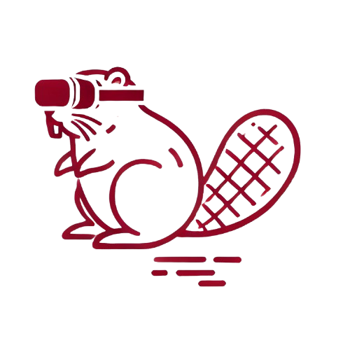

# BeaVR-Bot
**Bimanual, multi-Embodiment, Accessible VR Teleoperation for Robots**

<p align="center">
  
</p>

<p align="center">
  <strong>Alejandro Carrasco</strong> ·
  <strong>Alejandro Posadas-Nava</strong> ·
  <strong>Victor Rodriguez-Fernandez</strong> ·
  <strong>Richard Linares</strong>
</p>

<p align="center">
  <br>
  <a href="our-arxiv-link">
     Paper
  </a> |
  <a href="https://github.com/ArcLab-MIT/BeaVR">Project Page</a> |
  <a href="https://github.com/ArcLab-MIT/BeaVR/tree/main/docs">Documentation</a>
</p>

---

## Overview

BeaVR is an open-source, end-to-end teleoperation pipeline that leverages affordable hardware for robotics teleoperation. Building upon [Open Teach](https://open-teach.github.io/), we address its accessibility limitations and improve upon its bimanual teleoperation methodology to create a more robust and user-friendly system.

Key features:
- **VR teleoperation out-of-the-box** – Stream low-latency control and visual feedback through Meta Quest 3 (and any OculusVR supported device) while recording synchronized proprioceptive, visual, and action data.
- **Multi-embodiment support** – Ships with drivers and URDF assets for the RX-1 full-size humanoid and an xArm + LeapHand dexterous work-cell. The modular hardware abstraction layer lets you drop-in new robots with a single interface file.
- **Simulation parity** – Mirror every real-world session in MuJoCo or Isaac Gym for rapid domain-randomized policy training or sim-to-real transfer.
- **Dexterous demonstration collection** – Capture single-hand, bi-manual, or whole-body demonstrations for manipulation, assembly, or locomotion tasks—no motion-capture stage required.
- **Budget-friendly extensibility** – Works on commodity PCs and laptops with accessible robotics hardware.

### Why use BeaVR?
- **Accessible** – No proprietary hardware or licenses; every component is student-budget friendly and permissively BSD-3-licensed.
- **Modular & maintainable** – Clean and performant python and ROS modules.
- **LeRobot formatted data** – Standarizing data collection for shared robotics projects.
- **Community-driven** – Contributions already include UR-series arms, quadrupeds, and tactile grippers; PRs with new morphologies are welcome.

## Quick Start

### Prerequisites
- Python 3.10+
- NVIDIA GPU with CUDA support (recommended)
- Meta Quest 3 VR headset
- Conda package manager

### Installation

#### Conda Environment (Recommended for Development)

For development and running the full system with all dependencies (including PyTorch and simulation tools), we recommend using Conda:

```bash
conda env create -f environment.yml
```

After installing all the prerequisites, install this pipeline as a package:
```bash
pip install -e .
```

Verify the installation:
```bash
python -c "import beavr"
```

## Documentation

For detailed documentation, please refer to the following guides in the `docs` directory:

- [VR Setup and Configuration](docs/vr.md)
- [Robot Controller Setup](docs/robot_controller.md)
- [Sensor Integration](docs/sensors.md)
- [Simulation Environment](docs/simulation.md)
- [Teleoperation Data Collection](docs/teleop_data_collect.md)
- [Policy Learning](docs/policy_learning.md)
- [Adding Your Own Robot](docs/add_your_own_robot.md)S

## Citation

If you use BeaVR in your research, please cite our work:

[Add citation information here]

## License

[Add license information here]

## Contributing

We welcome contributions! Please see our [Contributing Guidelines](CONTRIBUTING.md) for more details.

## Acknowledgments

[Add acknowledgments here]

## Additional Features

### Apple Vision Pro Support
For users who prefer Apple Vision Pro optics, we provide a drop-in VisionProTeleop module that enables marker-less arm-pose tracking. This module integrates seamlessly with BeaVR as an alternative VR endpoint.


We welcome contributions! Please see our [Contributing Guidelines](CONTRIBUTING.md) for more details.

## Acknowledgments

[Add acknowledgments here]

